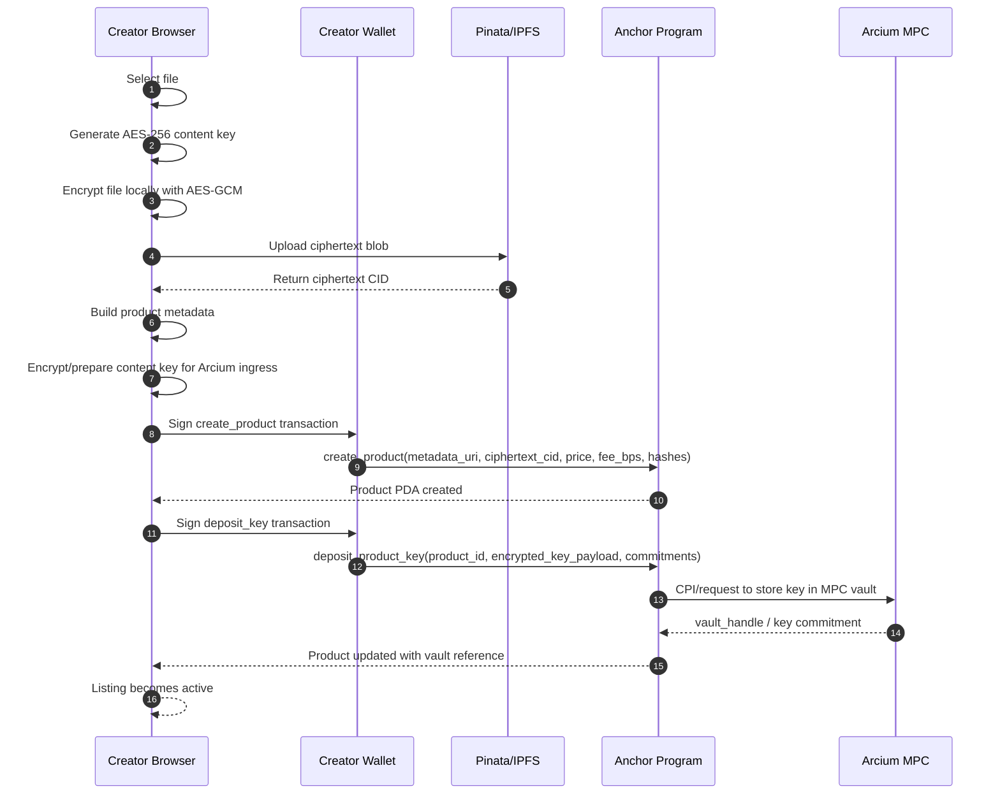
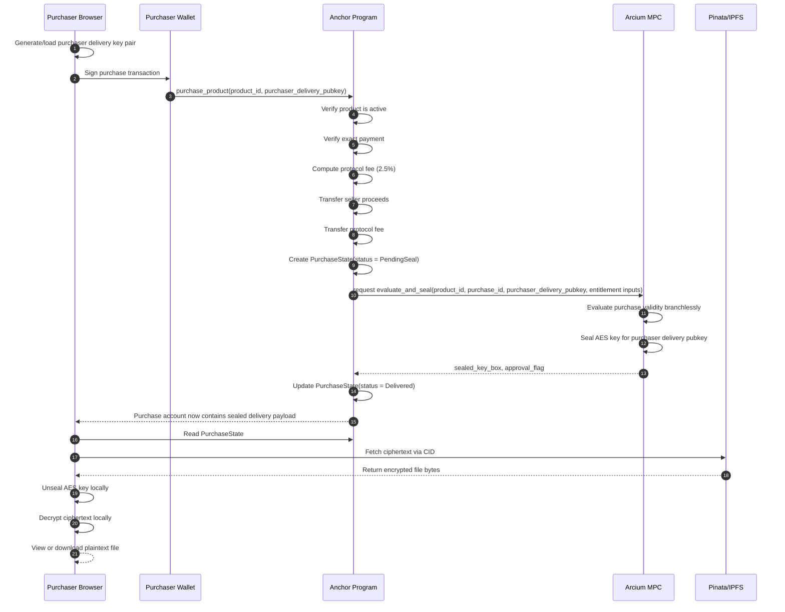

# SYSTEM DESIGN: Arxcess
## Web-Only Decentralized Digital Asset Marketplace on Solana + Arcium

## 1. Overview

Arxcess is a trust-minimized digital asset marketplace for selling downloadable digital goods such as images, PDFs, templates, datasets, and source code. The marketplace is designed so that:

- Creators can publish assets without handing plaintext files or encryption keys to the platform.
- Purchasers can buy assets on Solana and receive decryption access only after payment succeeds.
- The platform UI can coordinate listing, purchase, and delivery, but it cannot read or steal the protected content.
- Encryption key custody is delegated to Arcium's MPC network rather than a centralized backend.

The current frontend presents this model through four focused surfaces:

- `Home` for public product explanation and routing
- `Explore` for browsing and checkout
- `Launch` for publishing encrypted listings
- `Library` for delivery, reveal, and download

This design targets a **web-only** product experience:

- **Frontend:** Next.js
- **On-chain logic:** Solana + Anchor
- **Confidential key management:** Arcium Arcis / MPC circuits
- **Encrypted file storage:** Pinata/IPFS
- **Client-side crypto:** Browser Web Crypto API

No trusted application server is required for core purchase and delivery logic.

---

## 3. Design Goals

### Primary Goals

- Prevent the platform from viewing creators' paid content.
- Support simple creator listing and purchaser checkout flows from a browser only.
- Keep entitlement and payment verification on-chain.
- Keep content encryption key material under MPC custody.
- Make delivery auditable, deterministic, and programmable.
- Keep the public product UX minimal by giving each page one primary job.

### Secondary Goals

- Support protocol fees on each sale.
- Preserve low operational complexity for a hackathon MVP.
- Maintain a path to production hardening without redesigning core primitives.

### Non-Goals for V1

- DRM-grade prevention of purchaser redistribution after decryption.
- Streaming/video segment key rotation.
- Multi-recipient licensing trees.
- Refund arbitration or chargeback workflows.
- Complex off-chain search/recommendation systems.

---

## 4. High-Level Architecture

## 4.1 System Components

### 1. Next.js Frontend

Responsible for:

- Wallet connection
- Public navigation across `Home`, `Explore`, `Launch`, and `Library`
- Product creation UI
- Client-side AES key generation
- Client-side file encryption/decryption
- IPFS upload/download
- Calling Anchor program instructions
- Displaying purchased assets
- Managing the purchaser delivery key pair locally

The frontend is **orchestration and UX only**. It must not become a trusted custodian.

### 2. Solana Anchor Program

Responsible for:

- Product listing state
- Price enforcement
- Purchase recording
- Protocol fee calculation and settlement
- Seller payout settlement
- Authorizing Arcium requests
- Persisting purchase delivery state
- Preventing duplicate or unauthorized claims

The program is the marketplace's **source of truth for payment and entitlement**.

### 3. Arcium MPC / Arcis Circuits

Responsible for:

- Receiving and storing the symmetric content key under MPC custody
- Binding stored key material to a product identifier
- Evaluating whether a purchaser is entitled to receive access
- Re-encrypting or sealing the content key for the purchaser's delivery public key
- Returning a sealed payload without exposing the raw key to the platform

Arcium is the **confidential key control plane**.

### 4. Pinata / IPFS

Responsible for:

- Storing ciphertext blobs
- Storing optionally public metadata or preview assets
- Serving content-addressed encrypted files to purchasers after purchase

IPFS is the **durable content storage layer**, but only for ciphertext.

### 5. Wallet + Purchaser Delivery Keys

Responsible for:

- Authorizing create/purchase transactions
- Identifying purchaser and publisher accounts on Solana
- Optionally binding a dedicated encryption public key to a purchase

**Important architectural note:** a Solana wallet public key is not automatically suitable as a content-encryption recipient key. For delivery, Arxcess should use a **dedicated purchaser delivery key pair** generated in-browser for encryption/decryption purposes.

**Current frontend behavior:** the delivery key pair is auto-generated in-browser when needed, so checkout does not require a separate manual key setup step.

---

## 4.2 Separation of Concerns

| Layer | Responsibility | Must Never Do |
|---|---|---|
| Frontend | UX, browser crypto, uploads, downloads, wallet interactions | Hold server-side master secrets |
| Solana Program | Payment verification, state transitions, fee logic, authorization | Store plaintext files or raw AES keys |
| Arcium MPC | Confidential key storage, entitlement evaluation, sealed delivery | Act as payment ledger |
| IPFS/Pinata | Store encrypted blobs and metadata | Store plaintext premium files |
| Wallet | Sign transactions, identify users | Replace content encryption keys directly |

---

## 4.3 Trust Boundaries

### Public Data

- Product title
- Description
- Preview image or teaser
- Price
- Publisher wallet
- Ciphertext CID
- Product metadata URI
- Purchase status
- Protocol fee rate

### Confidential Data

- Raw content file before encryption
- Raw AES content key
- Purchaser delivery private key
- Purchaser-decrypted file content

### Protected but Publicly Stored

- Encrypted file ciphertext on IPFS
- Sealed key payload written to on-chain state or emitted in events

**Important distinction:** ciphertext and sealed key blobs may be publicly visible, but they must be unusable to anyone except the intended purchaser.

---

## 5. End-to-End Flows

## 5.1 Creator Launch Flow

### Summary

1. Creator selects a file in the browser.
2. Browser generates AES key and encrypts the file locally.
3. Ciphertext is uploaded to Pinata/IPFS.
4. Browser packages metadata and submits product creation to Solana.
5. Browser also submits the encrypted key payload for Arcium deposit.
6. Solana program records product state and associates the Arcium vault handle.

In the current product UX, this flow is presented inside the `Launch` surface and emphasizes only essential listing terms such as price, access window, reveal limit, and revocable status.

### Sequence Diagram



---

## 5.2 Purchase + Delivery + Reveal Flow

### Summary

1. A purchaser opens `Explore` and sees public metadata.
2. The browser generates or retrieves a local delivery key pair.
3. The connected wallet pays through Solana.
4. Program settles seller payout and protocol fee, then marks purchase as eligible.
5. The delivery flow produces a sealed payload for the purchaser delivery key.
6. The `Library` surface shows the purchase in `pending_seal` until delivery is finalized.
7. The publishing wallet finalizes delivery.
8. The purchasing wallet reveals and decrypts locally.

### Current Frontend Action Model

- `Finalize delivery` is shown only to the wallet that published the listing.
- `Reveal & download` is shown only to the wallet that created the purchase.
- `Revoke access` is shown only to the publishing wallet, and only when the listing policy is revocable.
- Wallets that do not match either role can still inspect purchase state, but they cannot trigger those actions from the UI.

### Sequence Diagram



---

## 6. State and Data Model

## 6.1 Product Model

A product represents a single encrypted digital asset listing.

### ProductState Purpose

- Stores commercial listing information
- Points to encrypted content on IPFS
- Binds the listing to a key held by Arcium
- Tracks lifecycle status and sales counters

### Suggested PDA

- Seed pattern: `["product", seller_pubkey, product_id]`

### Conceptual Anchor Account: `ProductState`

```text
ProductState
- bump: u8
- product_id: [u8; 32]
- seller: Pubkey
- treasury: Pubkey
- price_lamports: u64
- protocol_fee_bps: u16
- status: u8                // 0=draft, 1=active, 2=paused, 3=delisted
- metadata_uri: String/fixed bytes
- ciphertext_cid: String/fixed bytes
- preview_cid: String/fixed bytes (optional)
- file_mime_commitment: [u8; 32]
- plaintext_hash_commitment: [u8; 32]   // optional if the seller wants purchaser verifiability
- ciphertext_hash: [u8; 32]
- file_size_bytes: u64
- arcium_vault_handle: [u8; 32]
- key_commitment: [u8; 32]
- total_sales: u64
- created_at: i64
- updated_at: i64
```

### Notes

- `metadata_uri` may point to public metadata JSON on IPFS.
- `ciphertext_cid` points to the encrypted file, not plaintext.
- `arcium_vault_handle` is the on-chain reference to MPC-controlled content key storage.
- `key_commitment` is useful for integrity binding between the product and deposited key.
- Public-facing product copy may call the `seller` a `publisher`, but the underlying account model still uses `seller` internally.

---

## 6.2 Purchase Model

A purchase records purchaser entitlement and delivery status for one purchaser-product pair or one unique transaction.

### PurchaseState Purpose

- Records who paid
- Records how much was paid
- Stores fee split details
- Tracks whether delivery has been sealed
- Stores the sealed key payload for client retrieval

### Suggested PDA

Option A:
- `["purchase", product_pda, buyer_pubkey]`

Option B:
- `["purchase", purchase_id]`

**Recommendation:** use `purchase_id` for flexibility if repeat purchases, gifting, or relicensing may be added later.

### Conceptual Anchor Account: `PurchaseState`

```text
PurchaseState
- bump: u8
- purchase_id: [u8; 32]
- product: Pubkey
- buyer: Pubkey
- buyer_delivery_pubkey: [u8; 32] or [u8; 64]
- amount_paid_lamports: u64
- protocol_fee_lamports: u64
- seller_proceeds_lamports: u64
- status: u8                  // 0=initialized, 1=paid, 2=pending_seal, 3=delivered, 4=refunded, 5=revoked
- entitlement_flag: u8
- sealed_key_len: u16
- sealed_key_box: [u8; N]     // fixed-size delivery envelope
- ciphertext_cid_snapshot: String/fixed bytes
- delivery_commitment: [u8; 32]
- created_at: i64
- delivered_at: i64
```

### Notes

- `sealed_key_box` should use a **fixed-size byte array** for deterministic account sizing.
- `ciphertext_cid_snapshot` prevents ambiguity if a seller later updates metadata.
- `delivery_commitment` can bind the sealed response to the purchase and purchaser.
- Public-facing product copy may call the `buyer` a `purchaser`, but the underlying account model still uses `buyer` internally.

### Recommended V1 Status Flow

- `active product`
- purchaser pays
- `PurchaseState.status = pending_seal`
- Arcium response arrives
- `PurchaseState.status = delivered`

---

## 6.3 Product Metadata JSON

The public metadata file can be stored on IPFS and referenced by `metadata_uri`.

### Suggested Fields

```json
{
  "name": "Asset title",
  "description": "Public product description",
  "category": "ebook | code | image | template | dataset",
  "previewCid": "ipfs://...",
  "ciphertextCid": "ipfs://...",
  "mimeHint": "application/pdf",
  "sizeBytes": 1234567,
  "version": 1
}
```

### Important Rule

This metadata must contain **only public information**. It must not contain plaintext secrets, content keys, or unencrypted file samples unless intentionally public.

---

## 7. Arcium MPC Circuit Design

## 7.1 MPC Constraints That Must Be Respected

Arcium circuits must be designed with MPC-safe logic. The following constraints are critical:

- No early returns
- No variable-length secret-dependent loops
- Use fixed-size arrays for structured data
- Evaluate both branches of conditionals
- Avoid secret-dependent memory access patterns
- Prefer branchless selection over normal control flow
- Keep circuit inputs and outputs shape-stable and deterministic

These rules shape both the circuit interface and the surrounding on-chain protocol.

---

## 7.2 Circuit 1: `deposit_key`

### Purpose

Store a seller's content key under Arcium MPC custody and bind it to a product.

### Conceptual Inputs

#### Public Inputs

- `product_id: [u8; 32]`
- `seller_pubkey: [u8; 32]`
- `ciphertext_hash: [u8; 32]`
- `metadata_commitment: [u8; 32]`

#### Confidential / Encrypted Inputs

- `content_key: Enc<Mxe, [u8; 32]>`

### Conceptual Outputs

- `vault_handle: [u8; 32]`
- `key_commitment: [u8; 32]`
- `success_flag: u8`

### Responsibilities

- Accept the encrypted content key
- Store it in MPC-managed state
- Bind the stored key to the product identifier and integrity commitments
- Return a stable vault reference to the Solana program

### Pseudologic

```text
1. Accept encrypted content_key and public bindings
2. Compute commitment over (product_id, seller_pubkey, ciphertext_hash, content_key)
3. Store content_key under MPC custody
4. Return vault_handle and key_commitment
5. Return success_flag
```

### Design Notes

- The Solana program should only retain `vault_handle` and `key_commitment`.
- The raw AES key must never be materialized in the frontend after deposit, aside from the initial browser-side encryption step.

---

## 7.3 Circuit 2: `evaluate_and_seal`

### Purpose

Verify that a purchaser is entitled to access a product's content key and then seal that key to the purchaser's delivery public key.

### Conceptual Inputs

#### Public Inputs

- `product_id: [u8; 32]`
- `purchase_id: [u8; 32]`
- `purchaser_pubkey: [u8; 32]`
- `purchaser_delivery_pubkey: [u8; 32]` or `[u8; 64]`
- `payment_verified: u8`
- `product_active: u8`
- `purchase_not_revoked: u8`
- `delivery_not_yet_finalized: u8`
- `ciphertext_hash: [u8; 32]`

#### Confidential / Encrypted Inputs

- `content_key: Enc<Mxe, [u8; 32]>` via `vault_handle`

### Conceptual Outputs

- `approval_flag: u8`
- `sealed_key_box: [u8; N]`
- `delivery_commitment: [u8; 32]`

### Core Entitlement Predicate

A purchase is valid if all of the following hold:

- payment succeeded
- product is active
- purchase is not revoked/refunded
- delivery has not already been finalized

### Branchless MPC-Safe Pattern

Because normal branching is unsafe or restricted, the circuit should evaluate both possible outputs and then select.

### Pseudologic

```text
valid_purchase =
    payment_verified
    AND product_active
    AND purchase_not_revoked
    AND delivery_not_yet_finalized

sealed_real_key = seal(content_key, purchaser_delivery_pubkey)
sealed_zero_key = seal(ZERO_32_BYTES, purchaser_delivery_pubkey)

sealed_key_box = select(valid_purchase, sealed_real_key, sealed_zero_key)
approval_flag = valid_purchase

delivery_commitment = hash(
    product_id,
    purchase_id,
    purchaser_pubkey,
    purchaser_delivery_pubkey,
    approval_flag,
    sealed_key_box
)
```

### Why Seal a Zero Key for the False Branch?

This preserves a constant-shaped computation:

- both branches are evaluated
- output type and size remain identical
- no early return occurs
- invalidity is communicated by `approval_flag`

### Important Implementation Note

If the sealing primitive produces a variable-size envelope, normalize it into a fixed-size output buffer:

- choose a maximum envelope size `N`
- fill unused bytes with zeros
- return actual size separately if needed

---

## 7.4 Fixed-Size Data Recommendations for Circuits

For predictable circuit behavior, use fixed-width structures such as:

- `product_id: [u8; 32]`
- `purchase_id: [u8; 32]`
- `content_key: [u8; 32]`
- `ciphertext_hash: [u8; 32]`
- `purchaser_delivery_pubkey: [u8; 32]` or `[u8; 64]`
- `sealed_key_box: [u8; 192]` or `[u8; 256]`

All string-like values such as CIDs should be hashed before passing into circuits unless there is a strong reason to pass fixed-length ASCII buffers.

---

## 8. Protocol Logic

## 8.1 Publisher Listing Lifecycle

### `create_product`

Creates the `ProductState` PDA with public product metadata and price.

### `deposit_product_key`

Binds the product to an MPC-stored key by invoking the `deposit_key` flow.

### `activate_product`

Marks the listing as sellable after both metadata and vault handle are present.

### `pause_or_delist_product`

Lets the publisher stop future purchases without deleting historical purchases.

---

## 8.2 Purchaser Purchase Lifecycle

### `purchase_product`

- verifies product is active
- verifies purchaser sent exact payment
- calculates protocol fee
- transfers fee to protocol treasury
- transfers seller proceeds
- creates `PurchaseState`
- requests Arcium `evaluate_and_seal`

### `finalize_delivery`

Depending on Arcium integration style, this may be:

- a callback-driven write by an authorized program path, or
- a follow-up instruction that writes returned sealed payload into `PurchaseState`

### `claim_content`

In the simplest design, this is not a separate instruction. The purchaser simply reads the `PurchaseState` account and decrypts locally.

---

## 8.3 Fee Logic

For a 2.5% fee:

- `protocol_fee_bps = 250`

Formula:

```text
protocol_fee = amount_paid * protocol_fee_bps / 10_000
seller_proceeds = amount_paid - protocol_fee
```

### Invariants

- `protocol_fee_bps <= 10_000`
- `amount_paid == product.price_lamports`
- `seller_proceeds + protocol_fee == amount_paid`

---

## 9. Security Model

## 9.1 What the Platform Can See

- Public metadata
- On-chain state
- Ciphertext CID
- Transaction history
- Sealed delivery blob

## 9.2 What the Platform Cannot See

- Plaintext file after publisher encryption
- Raw AES content key after Arcium deposit
- Purchaser delivery private key
- Purchaser plaintext after local decryption

## 9.3 Residual Risks

### Purchaser Redistribution Risk

Any purchaser who decrypts a file can re-share it. This architecture prevents platform theft, not end-user redistribution.

### Frontend Supply Chain Risk

A malicious frontend deployment could exfiltrate keys before deposit or after delivery. Production deployments should harden:

- static asset integrity
- domain security
- release signing
- wallet signature prompts
- transparent source builds

### IPFS Upload Credential Risk

A truly web-only architecture has a tradeoff around client-side Pinata upload authorization. For a hackathon MVP, direct upload is acceptable. For production, delegated upload tokens or a minimal signing service is safer.

### Delivery Key Loss

If a purchaser loses the local delivery private key, they may lose decryption ability on that device. A recovery UX should be designed later.

---

## 10. Recommended Monorepo Structure

```text
arxcess/
├── frontend/
│   ├── app/
│   │   ├── (marketing)/
│   │   ├── products/
│   │   ├── purchases/
│   │   └── seller/
│   ├── components/
│   │   ├── marketplace/
│   │   ├── wallet/
│   │   ├── upload/
│   │   └── purchase/
│   ├── hooks/
│   │   ├── useProducts.ts
│   │   ├── usePurchases.ts
│   │   ├── useEncryptFile.ts
│   │   ├── useDecryptAsset.ts
│   │   └── useDeliveryKeys.ts
│   ├── lib/
│   │   ├── anchor/
│   │   ├── arcium/
│   │   ├── crypto/
│   │   ├── ipfs/
│   │   └── solana/
│   ├── public/
│   ├── styles/
│   ├── package.json
│   └── tsconfig.json
│
├── contracts/
│   ├── programs/
│   │   └── arxcess/
│   │       ├── src/
│   │       │   ├── instructions/
│   │       │   │   ├── create_product.rs
│   │       │   │   ├── deposit_product_key.rs
│   │       │   │   ├── activate_product.rs
│   │       │   │   ├── purchase_product.rs
│   │       │   │   ├── finalize_delivery.rs
│   │       │   │   └── pause_product.rs
│   │       │   ├── state/
│   │       │   │   ├── product_state.rs
│   │       │   │   └── purchase_state.rs
│   │       │   ├── errors.rs
│   │       │   ├── events.rs
│   │       │   ├── constants.rs
│   │       │   └── lib.rs
│   ├── tests/
│   ├── migrations/
│   ├── Anchor.toml
│   └── Cargo.toml
│
├── encrypted-ixs/
│   ├── src/
│   │   ├── lib.rs
│   │   ├── deposit_key.rs
│   │   └── evaluate_and_seal.rs
│   ├── Cargo.toml
│   └── README.md
│
├── sdk/
│   ├── ts/
│   │   ├── src/
│   │   │   ├── ids.ts
│   │   │   ├── pda.ts
│   │   │   ├── product.ts
│   │   │   ├── purchase.ts
│   │   │   ├── arcium.ts
│   │   │   └── crypto.ts
│   │   └── package.json
│   └── rust/
│
├── tests/
│   ├── e2e/
│   ├── integration/
│   └── fixtures/
│
├── scripts/
│   ├── devnet/
│   ├── seed/
│   └── verify/
│
├── context/
│   ├── project.md
│   └── threat-model.md
│
├── SYSTEM_DESIGN.md
├── package.json
├── Cargo.toml
└── README.md
```

---

## 11. API and Responsibility Boundaries

## 11.1 Frontend Module Boundaries

### `lib/crypto`

Responsible for:

- AES key generation
- file encryption
- file decryption
- purchaser delivery key generation
- sealed key unwrapping helpers

### `lib/ipfs`

Responsible for:

- upload ciphertext to Pinata
- fetch ciphertext by CID
- upload metadata JSON

### `lib/anchor`

Responsible for:

- constructing and sending Anchor instructions
- decoding product and purchase accounts
- event parsing

### `lib/arcium`

Responsible for:

- formatting circuit inputs
- interacting with Arcium-compatible client SDK helpers
- parsing sealed delivery responses

---

## 11.2 Contract Module Boundaries

### `create_product`

Defines listing metadata and price.

### `deposit_product_key`

Attaches Arcium vault reference and key commitment.

### `purchase_product`

Handles payment, fee distribution, and purchase initialization.

### `finalize_delivery`

Writes sealed payload and marks delivery complete.

### `pause_product`

Stops future sales.

---

## 12. Operational Notes

## 12.1 Indexing

The marketplace UI will eventually need indexed queries such as:

- list all active products
- list all products by publisher
- list all purchases by purchaser
- list newly delivered purchases

For the MVP:

- direct RPC reads are sufficient for a small dataset

For scale:

- add a Solana indexing layer later

---

## 12.2 Async Delivery Consideration

Depending on Arcium integration latency, delivery may not finalize in the same transaction as payment.

### Recommended State Machine

- `purchase_product` => `pending_seal`
- Arcium response arrives
- `finalize_delivery` => `delivered`

The purchaser-facing `Library` surface should poll or subscribe for `PurchaseState.status == delivered`.

In the current frontend UX:

- the publishing wallet performs finalize when needed
- the purchasing wallet performs reveal after delivery is ready
- revoke is only exposed when the listing policy allows it

---

## 12.3 Account Size Pressure

Storing `sealed_key_box` directly in `PurchaseState` is convenient for a hackathon MVP, but if envelope size grows:

- move delivery payload to a separate `DeliveryState`
- or chunk it across fixed-size records
- or emit delivery via event plus verification commitment on-chain

For V1, storing the sealed blob in `PurchaseState` is the simplest design.

---

## 13. Step-by-Step Implementation Roadmap

## Phase 0: Finalize Core Decisions

- Confirm payment asset for V1: native SOL recommended
- Confirm delivery key scheme
- Confirm Arcium ingress and sealing format
- Fix target envelope sizes for sealed payloads
- Fix product metadata schema
- Freeze protocol fee at `250 bps` for MVP

### Deliverable

- Approved interfaces for `ProductState`, `PurchaseState`, `deposit_key`, and `evaluate_and_seal`

---

## Phase 1: Monorepo Scaffolding

- Scaffold Next.js app under `frontend/`
- Scaffold Anchor workspace under `contracts/`
- Scaffold Arcium circuit crate under `encrypted-ixs/`
- Add shared TypeScript SDK under `sdk/ts`
- Add root workspace configs

### Deliverable

- Repository builds with placeholder modules and consistent workspace layout

---

## Phase 2: Browser Cryptography Layer

- Implement AES-256-GCM file encryption in browser
- Implement file decryption in browser
- Implement purchaser delivery key generation and storage
- Implement content hashing and metadata commitment helpers

### Deliverable

- Local-only encryption/decryption flow works before any chain integration

---

## Phase 3: IPFS Storage Integration

- Upload ciphertext blobs to Pinata
- Upload metadata JSON to Pinata
- Fetch ciphertext by CID
- Validate ciphertext hash after retrieval

### Deliverable

- Publisher can create encrypted asset package and receive deterministic IPFS references

---

## Phase 4: Anchor Product Listing Contract

- Implement `ProductState`
- Implement `create_product`
- Implement `activate_product`
- Implement `pause_product`
- Add publisher authorization and status checks
- Add events for product creation and updates

### Deliverable

- Publishers can create public listings on-chain

---

## Phase 5: Arcium Key Deposit Flow

- Implement `deposit_key` circuit with fixed-size inputs
- Implement Solana instruction that requests MPC deposit
- Persist `arcium_vault_handle` and `key_commitment` into `ProductState`
- Add validation that products cannot be activated without vault registration

### Deliverable

- Each active product is bound to an MPC-custodied content key

---

## Phase 6: Purchase and Settlement Flow

- Implement `PurchaseState`
- Implement `purchase_product`
- Enforce exact payment amount
- Compute and transfer protocol fee
- Transfer seller proceeds
- Store purchaser delivery public key
- Initialize purchase status to `pending_seal`

### Deliverable

- Purchaser payment is finalized on-chain with auditable fee accounting

---

## Phase 7: Arcium Entitlement + Sealed Delivery

- Implement `evaluate_and_seal` circuit
- Use branchless entitlement logic
- Seal actual key or zero key in constant-shaped output
- Implement `finalize_delivery`
- Persist `sealed_key_box` and update purchase status

### Deliverable

- Purchasers receive sealed content keys after valid payment

---

## Phase 8: Library Reveal UX

- Build library page
- Fetch `PurchaseState`
- Unseal the purchaser's content key locally
- Download ciphertext from IPFS
- Decrypt locally for preview/download

### Deliverable

- End-to-end paid content access works fully in browser

---

## Phase 9: Testing and Security Hardening

- Unit test fee math and entitlement logic
- Integration test product creation and purchase flow
- E2E test creator upload to purchaser decryption
- Adversarial test invalid purchases and repeated delivery attempts
- Audit account size calculations and replay protections
- Validate MPC constraints in both circuits

### Deliverable

- Stable hackathon demo with confidence in core invariants

---

## Phase 10: Devnet Demo and Polish

- Deploy program to Solana devnet
- Configure frontend for devnet RPC
- Seed sample products
- Refine Explore, Launch, and Library surfaces
- Add preview UX and error states
- Add explorer and IPFS links for transparency

### Deliverable

- Demo-ready Arxcess marketplace on devnet

---

## 14. Key Invariants

The following invariants should hold across the system:

- A product cannot be sold unless it is active.
- A product should not be active until its key is successfully deposited into Arcium.
- A buyer cannot receive a valid sealed key unless payment is verified.
- Protocol fee and seller proceeds must exactly sum to the amount paid.
- The raw content key must never be stored on Solana.
- The platform must only ever store ciphertext or sealed blobs.
- MPC circuits must remain fixed-shape and branchless in behavior.

---

## 15. Recommended MVP Scope

To maximize hackathon success, the MVP should be constrained to:

- one file per product
- one-time purchase access
- native SOL payments only
- browser-generated AES-256 content key
- dedicated buyer delivery keypair
- on-chain storage of sealed key envelope in `PurchaseState`
- no refunds
- no seller edits after activation except pause/delist

This scope is sufficient to demonstrate:

- trust-minimized encrypted commerce
- on-chain entitlement
- MPC-controlled key release
- fully web-based purchaser delivery

---

## 16. Future Extensions

After the MVP, Arxcess can evolve to support:

- SPL token payments
- bundles and collections
- royalty splits across collaborators
- time-limited rentals
- watermarking and personalized exports
- subscription-gated delivery
- private metadata fields
- programmable licensing terms
- indexer-backed marketplace discovery
- delegated access or team ownership

---

## 17. Final Recommendation

For the hackathon build, Arxcess should optimize for a simple but credible trust model:

- Encrypt in the browser
- Store ciphertext on IPFS
- Store content keys in Arcium MPC
- Enforce payment and fee logic on Solana
- Seal keys only to paying purchasers
- Decrypt only in the purchaser's browser

This architecture is strong because each layer has a narrow job:

- **Frontend** handles UX and local crypto
- **Solana** handles money and entitlement
- **Arcium** handles confidential key custody and release
- **IPFS** handles durable encrypted storage

That separation makes the system easier to build, easier to reason about, and much harder for the marketplace itself to abuse.